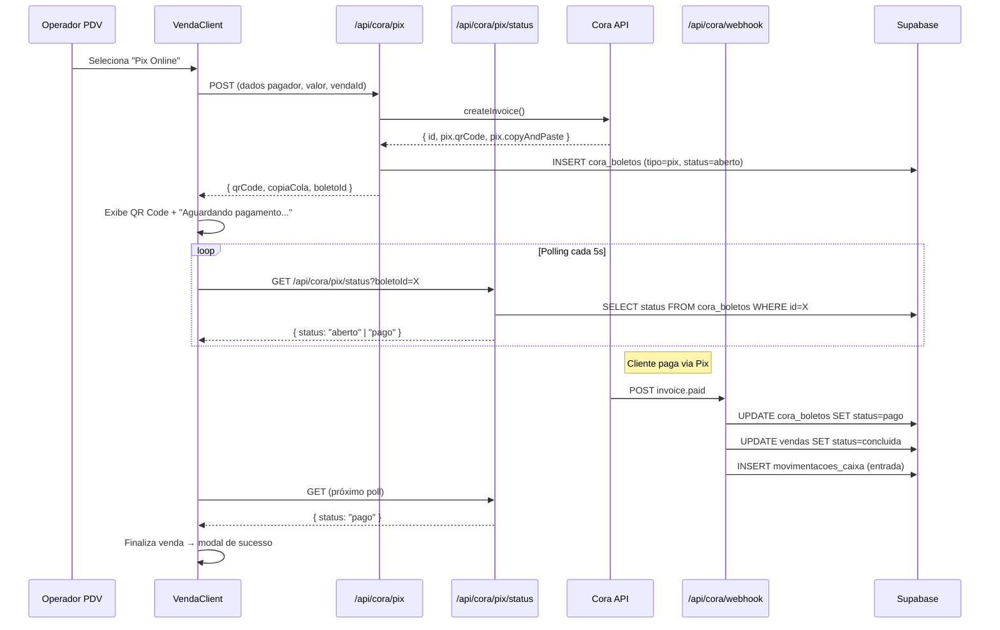
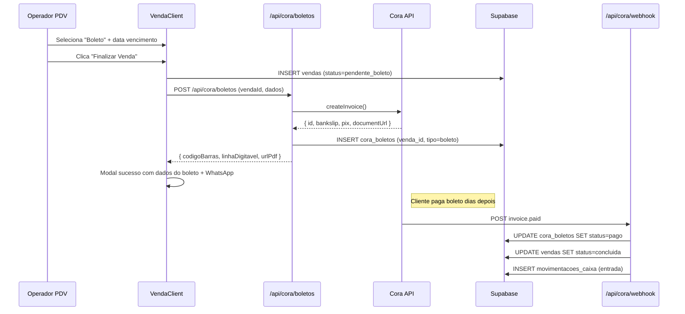
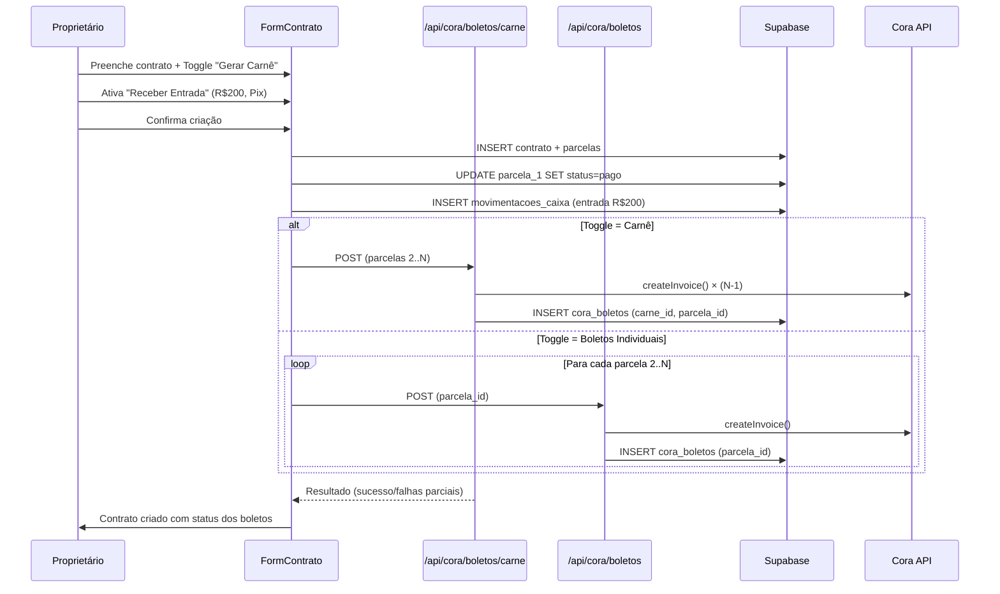
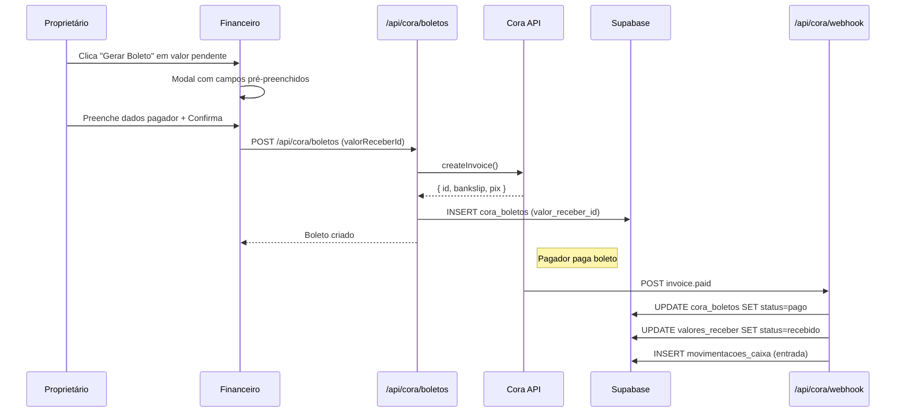
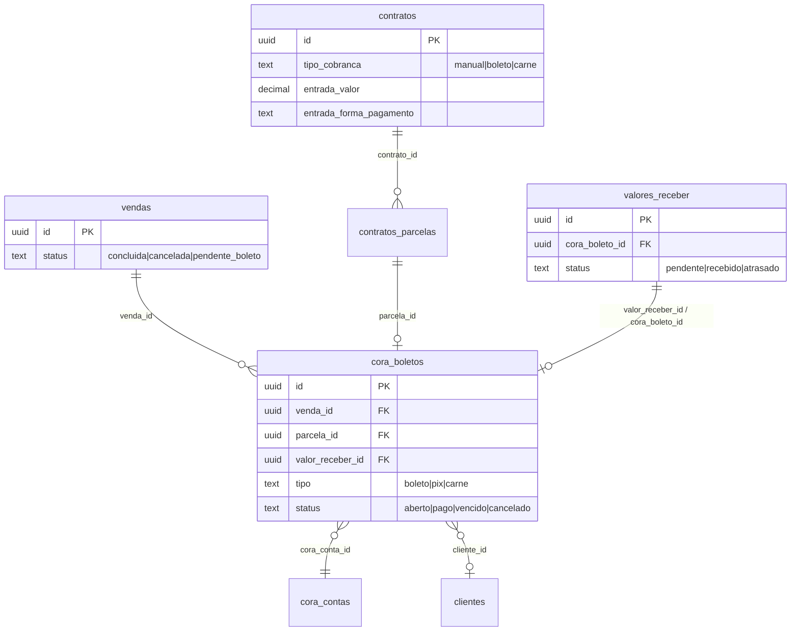

# Design Document: Melhorias Cora Cobranças

## Overview

Este design abrange três melhorias principais na integração Cora Pagamentos do Bora Gerir:

1. **PDV (Pix Online + Boleto)**: O Pix Online exibe QR Code na tela do PDV com polling de 5s para detecção de pagamento em tempo real. O Boleto gera cobrança registrada sem impactar o saldo do caixa até confirmação via webhook.
2. **Contratos (Toggle Boleto/Carnê + Entrada)**: Ao criar contratos, o proprietário pode escolher entre boletos individuais ou carnê. Opção de registrar entrada (pagamento da 1ª parcela) com forma de pagamento flexível.
3. **Valores a Receber (Gerar Boleto)**: Botão para emitir boleto vinculado a qualquer valor a receber pendente, com reconciliação automática via webhook.
4. **Página de Boletos**: Página dedicada para gestão centralizada de todos os boletos emitidos, com filtros, resumo e ações (cancelar, reenviar).

**Decisões Arquiteturais Chave**:
- **Detecção de Pix**: Polling client-side a cada 5s no endpoint `/api/cora/pix/status` (mais simples que SSE, compatível com Vercel serverless).
- **Status de venda com boleto**: Novo status `pendente_boleto` na tabela `vendas` — distinção clara de vendas em aberto vs concluídas.
- **Vínculo valores_receber ↔ cora_boletos**: Nova coluna `valor_receber_id` em `cora_boletos` para rastreamento direto.
- **Entrada em contratos**: A primeira parcela é marcada como "pago" no momento da criação e gera movimentação no caixa com a forma de pagamento escolhida.

**Stack**: Next.js 16 (App Router) + Supabase (PostgreSQL) + Tailwind v4 + Vercel  
**Integração existente**: `lib/cora/*`, `app/api/cora/*`, `components/cora/*`

---

## Architecture

### Fluxo Pix Online no PDV



### Fluxo Boleto no PDV



### Fluxo Contrato com Boleto/Carnê + Entrada



### Fluxo Gerar Boleto em Valores a Receber



---

## Components and Interfaces

### Novos Endpoints de API

| Route | Method | Descrição |
|-------|--------|-----------|
| `/api/cora/pix/status` | GET | Polling do status de cobrança Pix (param: `boletoId`) |
| `/api/cora/boletos/cancelar` | POST | Cancelar boleto (param: `boletoId`) |
| `/api/cora/boletos/reenviar` | POST | Reenviar boleto via WhatsApp (param: `boletoId`) |

### Endpoint `/api/cora/pix/status`

```typescript
// GET /api/cora/pix/status?boletoId=UUID
// Resposta: { status: "aberto" | "pago" | "vencido" | "cancelado", dataPagamento?: string }
// Usado pelo PDV para polling. Consulta apenas o banco local (sem chamada à Cora).
```

### Endpoint `/api/cora/boletos/cancelar`

```typescript
// POST /api/cora/boletos/cancelar
// Body: { boletoId: string }
// 1. Busca boleto → valida status é "aberto" ou "vencido"
// 2. Chama coraClient.cancelInvoice(cora_invoice_id)
// 3. UPDATE cora_boletos SET status=cancelado, data_cancelamento=now()
// 4. Registra audit log
```

### Novos/Atualizados Componentes Frontend

| Componente | Descrição | Localização |
|-----------|-----------|-------------|
| `PixOnlinePanel` | QR Code + copia-e-cola + polling + cancelar | `components/venda/pix-online-panel.tsx` |
| `BoletoResultModal` | Modal sucesso com dados boleto + WhatsApp | `components/venda/boleto-result-modal.tsx` |
| `BoletosPage` | Página de gestão de boletos | `components/cora/boletos-page.tsx` |
| `ContratoFormCora` | Toggle boleto/carnê + entrada no form contrato | Integrado em `contratos-client.tsx` |
| `GerarBoletoModal` | Modal para gerar boleto de valor a receber | `components/financeiro/gerar-boleto-modal.tsx` |

### Atualizações em Componentes Existentes

| Componente | Alteração |
|-----------|-----------|
| `venda-client.tsx` | Novo flow para "Pix Online" e "Boleto" — exibe PixOnlinePanel ou gera boleto |
| `contratos-client.tsx` | Toggle boleto/carnê, campos de entrada, integração com API Cora |
| `financeiro-client.tsx` | Botão "Gerar Boleto" em valores a receber + GerarBoletoModal |
| `app/api/cora/webhook/route.ts` | Estender reconciliação: vendas pendente_boleto → concluida + caixa; valores_receber → recebido + caixa |
| `app/(app)/layout.tsx` | Adicionar item "Boletos" no menu lateral |

---

## Data Models

### Alterações na Tabela `vendas`

```sql
-- Adicionar 'pendente_boleto' como status válido
-- Status existentes: concluida, cancelada
-- Novo: pendente_boleto (venda finalizada aguardando pagamento do boleto)
ALTER TABLE vendas 
  DROP CONSTRAINT IF EXISTS vendas_status_check;
ALTER TABLE vendas 
  ADD CONSTRAINT vendas_status_check 
  CHECK (status IN ('concluida', 'cancelada', 'pendente_boleto'));
```

### Alterações na Tabela `cora_boletos`

```sql
-- Adicionar coluna para vincular a valores_receber
ALTER TABLE cora_boletos 
  ADD COLUMN valor_receber_id UUID REFERENCES valores_receber(id);

-- Índice para busca por valor_receber_id
CREATE INDEX idx_cora_boletos_valor_receber ON cora_boletos(valor_receber_id);
```

### Alterações na Tabela `valores_receber`

```sql
-- Adicionar coluna para rastrear boleto vinculado (facilita consulta no frontend)
ALTER TABLE valores_receber 
  ADD COLUMN cora_boleto_id UUID REFERENCES cora_boletos(id);
```

### Alterações na Tabela `contratos`

```sql
-- Adicionar campo para tipo de cobrança
ALTER TABLE contratos 
  ADD COLUMN tipo_cobranca TEXT DEFAULT 'manual' 
  CHECK (tipo_cobranca IN ('manual', 'boleto', 'carne'));

-- Registrar se houve entrada
ALTER TABLE contratos 
  ADD COLUMN entrada_valor DECIMAL(10,2) DEFAULT 0;
ALTER TABLE contratos 
  ADD COLUMN entrada_forma_pagamento TEXT;
```

### Resumo de Relações



---

## Correctness Properties

*A property is a characteristic or behavior that should hold true across all valid executions of a system — essentially, a formal statement about what the system should do. Properties serve as the bridge between human-readable specifications and machine-verifiable correctness guarantees.*

### Property 1: Venda pendente_boleto não gera movimentação no caixa

*For any* venda registrada com status "pendente_boleto", não SHALL existir nenhuma movimentação na tabela `movimentacoes_caixa` vinculada a essa venda (até que o webhook confirme pagamento).

**Validates: Requirements 2.2**

### Property 2: Webhook paid cria movimentação e atualiza venda

*For any* evento webhook "invoice.paid" para um boleto vinculado a uma venda com status "pendente_boleto", o processamento SHALL resultar em: (a) venda atualizada para "concluida", (b) exatamente uma movimentação de entrada criada no caixa com o valor correto.

**Validates: Requirements 2.3, 7.1**

### Property 3: Webhook paid em valor_receber atualiza status

*For any* evento webhook "invoice.paid" para um boleto vinculado a um valor a receber com status "pendente", o processamento SHALL resultar em: (a) valor_receber atualizado para "recebido", (b) exatamente uma movimentação de entrada criada no caixa.

**Validates: Requirements 6.4, 7.3**

### Property 4: Filtro de boletos retorna resultados corretos

*For any* conjunto de boletos e qualquer combinação de filtros (status, período de vencimento, nome do cliente), todos os resultados retornados SHALL satisfazer todos os critérios de filtro aplicados, e nenhum boleto que satisfaça os critérios SHALL ser excluído.

**Validates: Requirements 3.2**

### Property 5: Contrato com entrada exclui primeira parcela dos boletos

*For any* contrato criado com entrada, os boletos gerados (individuais ou carnê) SHALL corresponder apenas às parcelas 2..N, e a primeira parcela SHALL ter status "pago" com data_pagamento igual à data de criação.

**Validates: Requirements 5.3, 5.4**

### Property 6: Carnê split preserva valor total

*For any* contrato com valor mensal V e N parcelas, a soma dos valores de todos os boletos gerados (excluindo parcela com entrada) SHALL ser igual a V × (número de parcelas sem entrada).

**Validates: Requirements 4.3**

### Property 7: Cancelamento de boleto é idempotente

*For any* boleto com status "cancelado", uma tentativa subsequente de cancelamento SHALL ser rejeitada sem modificar o estado do banco de dados.

**Validates: Requirements 3.4**

### Property 8: Polling retorna apenas estado local

*For any* requisição ao endpoint `/api/cora/pix/status`, a resposta SHALL refletir o status atual do `cora_boletos` no banco local, sem realizar chamadas à API externa da Cora.

**Validates: Requirements 1.2**

### Property 9: Restrição de plano bloqueia operações Cora

*For any* empresa sem plano "profissional", todas as operações de emissão de boleto, Pix e acesso à página de Boletos SHALL ser bloqueadas com HTTP 403 sem executar lógica de negócio.

**Validates: Requirements 8.1, 8.2, 8.3, 8.5**

---

## Error Handling

### Erros por Fluxo

| Fluxo | Erro | Tratamento |
|-------|------|------------|
| Pix Online (PDV) | Cora API falha ao criar invoice | Toast de erro + operador pode escolher outra forma de pagamento |
| Pix Online (PDV) | Polling timeout (5 min sem pagamento) | Exibir opção "Cancelar Pix" + permitir troca de forma |
| Boleto (PDV) | Cora API falha | Toast de erro + manter itens da venda intactos |
| Boleto (PDV) | Venda criada mas boleto falha | DELETE venda criada, retornar estado anterior |
| Contrato (Carnê) | Falha parcial na geração | Informar quais parcelas tiveram sucesso, manter contrato ativo |
| Valores a Receber | Cora API falha | Modal de erro, manter valor_receber inalterado |
| Webhook | Boleto não encontrado | Log warning + 200 OK (não bloquear) |
| Webhook | Caixa não aberto | Criar movimentação vinculada ao último caixa fechado da empresa ou registrar pendência |

### Rollback no PDV (Boleto)

A venda é criada ANTES do boleto ser emitido na Cora (necessário para ter o `venda_id` no boleto). Se a emissão falhar:
1. DELETE da venda recém-criada
2. Restaurar estado do PDV com itens intactos
3. Exibir mensagem de erro com opção de tentar novamente ou escolher outra forma

### Timeout no Polling Pix

- Após 5 minutos de polling sem pagamento, exibir alerta: "Pix não detectado. Deseja continuar aguardando ou cancelar?"
- Se cancelar: chamar `/api/cora/pix` DELETE para cancelar invoice na Cora
- O QR Code da Cora tem validade de ~30 min (padrão Cora)

### Caixa Fechado no Webhook

Quando o webhook detecta pagamento mas não há caixa aberto:
- A venda/valor_receber é atualizada normalmente
- A movimentação de caixa fica "pendente" — é registrada com o `caixa_id` do último caixa aberto, ou armazenada para reconciliação manual quando o caixa reabrir

**Decisão**: Registrar no último caixa fechado com flag `reconciliacao_webhook = true` para rastreabilidade.

---

## Testing Strategy

### Abordagem

**Property-Based Tests (fast-check)**:
- Biblioteca: `fast-check` (TypeScript)
- Mínimo 100 iterações por property test
- Foco: lógica de reconciliação webhook, filtros de boleto, cálculo de parcelas com entrada, validação de plano
- Tag format: `Feature: melhorias-cora-cobrancas, Property N: [title]`

**Unit Tests (Vitest)**:
- Mocks da Cora API (fetch mockado)
- Testes do endpoint `/api/cora/pix/status` 
- Testes do webhook estendido (novos fluxos: venda pendente_boleto, valores_receber)
- Edge cases: caixa fechado, boleto duplicado, contrato sem entrada

**Integration Tests**:
- Fluxo PDV Pix: criar → polling → webhook → finalização
- Fluxo Contrato: criar com entrada → gerar carnê → webhook → auto-conclusão
- Fluxo Valores a Receber: gerar boleto → webhook → recebido

### Cobertura por Property

| Property | Área Testada | Tipo |
|----------|-------------|------|
| P1: Venda pendente sem movimentação | Webhook handler / PDV | Property |
| P2: Webhook paid → venda concluida + caixa | Webhook handler | Property |
| P3: Webhook paid → valor_receber recebido | Webhook handler | Property |
| P4: Filtro de boletos | API GET /boletos | Property |
| P5: Entrada exclui 1ª parcela dos boletos | Contrato creation logic | Property |
| P6: Carnê preserva valor total | Cálculo de parcelas | Property |
| P7: Cancelamento idempotente | API cancelar boleto | Property |
| P8: Polling sem chamada externa | API pix/status | Example |
| P9: Restrição de plano | Middleware | Property |

### Configuração

```typescript
// Cada property test:
// - 100+ iterações
// - Comentário: Feature: melhorias-cora-cobrancas, Property N: {title}
// - Generators: vendas com status variados, boletos com tipos/status variados, contratos com N parcelas

// Testes unitários focam em:
// - Edge: contrato com 1 parcela + entrada (nenhum boleto gerado)
// - Edge: polling quando boleto já cancelado
// - Edge: webhook duplicado (idempotência)
// - Edge: valor_receber já com boleto vinculado (botão oculto)
```
